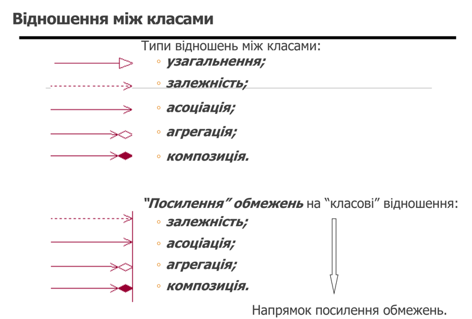
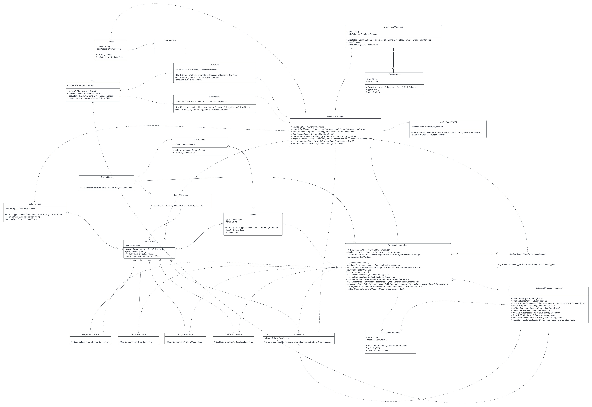

#### Task objectives

> Розробка (власних!) класів для понять "Таблиця", "База" та, можливо, деяких інших класів, спряжених із поняттям "
> Таблиця" (наприклад, "Схема таблиці", "Атрибут", "Рядок таблиці" тощо)
> Створення UML-діаграми класів (з наявними між класами відношеннями).
> Проведення unit-тестування. Надати 3..* тести, один з яких має бути призначеним для тестуванням “індивідуальної” (
> варіантної) операції з розділу III.
> Забезпечення інтерфейсу користувача на основі форм.

#### Theoretical information

> In UML, the abstract class has the same notation as that of the class. The only difference between a class and an
> abstract class is that the class name is strictly written in an italic font.

> * **Aggregation** implies a relationship where the <u>**child can exist independently of the parent**</u>. Example:
    Class (parent)
    and Student (child). Delete the Class and the Students still exist.
> * **Composition** implies a relationship where the <u>**child cannot exist independent of the parent**</u>. Example:
    House (parent)
    and Room (child). Rooms don't exist separate to a House.

> Якщо у діаграмі взаємодій використовується повідомлення
> між об'єктами двох класів, то рекомендується встановити
> відношення асоціації між відповідними класами (напрямок – від
> “клієнта” до “постачальника” сервісу).

#### Class diagram

#### Used resources:

* [Basic writing and formatting syntax](https://docs.github.com/en/get-started/writing-on-github/getting-started-with-writing-and-formatting-on-github/basic-writing-and-formatting-syntax)
* [UML Class Diagram Tutorial: Abstract Class with Examples](https://www.guru99.com/uml-class-diagram.html)
* [UML Association vs Aggregation vs Composition](https://www.visual-paradigm.com/guide/uml-unified-modeling-language/uml-aggregation-vs-composition/)

